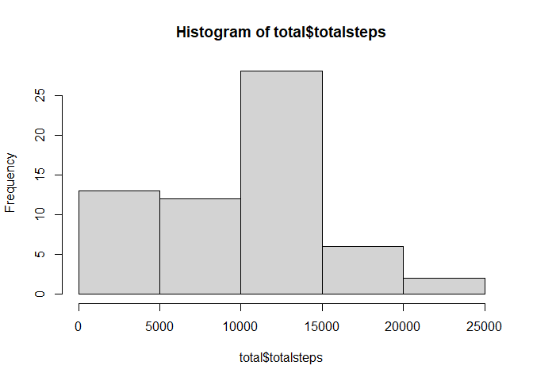
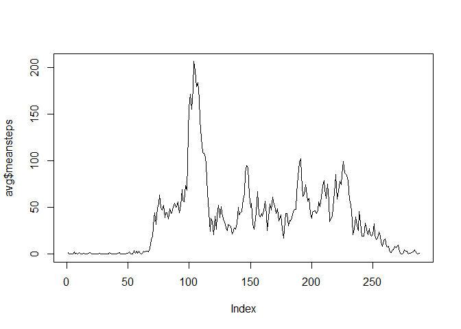
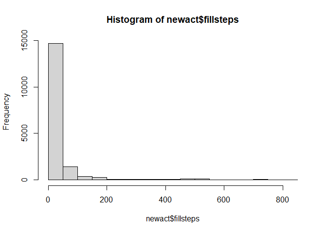
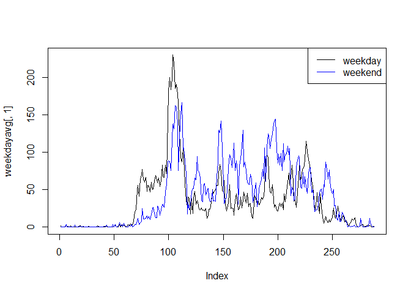

## Loading and preprocessing the data

```r
setwd("H:/DataScienceCoursera/ReproducibleResearch/RepData_PeerAssessment1")
act<-read.csv("./activity.csv")
act$date<-as.Date(act$date)
library(dplyr)
```

```
## 
## Attaching package: 'dplyr'
```

```
## The following objects are masked from 'package:stats':
## 
##     filter, lag
```

```
## The following objects are masked from 'package:base':
## 
##     intersect, setdiff, setequal, union
```

```r
library(plyr)
```

```
## ------------------------------------------------------------------------------
```

```
## You have loaded plyr after dplyr - this is likely to cause problems.
## If you need functions from both plyr and dplyr, please load plyr first, then dplyr:
## library(plyr); library(dplyr)
```

```
## ------------------------------------------------------------------------------
```

```
## 
## Attaching package: 'plyr'
```

```
## The following objects are masked from 'package:dplyr':
## 
##     arrange, count, desc, failwith, id, mutate, rename, summarise,
##     summarize
```


## What is mean total number of steps taken per day?

```r
total<-as.data.frame(tapply(act$steps, act$date, sum,na.rm=T))
colnames(total)[1]<-"totalsteps"
hist(total$totalsteps)
```

<!-- -->

```r
meant<-mean(total[,1])
mediant<-median(total[,1])
```
The mean and median total number of steps taken per day for the activity data were 9354.2295082 and 10395 respectively.

## What is the average daily activity pattern?

```r
avg<-as.data.frame(tapply(act$steps,act$interval,mean,na.rm=T))
colnames(avg)[1]<-"meansteps"
maxrow<-which(avg$meansteps==max(avg$meansteps))
max<-row.names(avg)[maxrow]
plot(avg$meansteps,type="l")
```

<!-- -->

The 5-minute interval of 835, on average across all the days in the dataset, contains the maximum number of steps

## Imputing missing values

```r
nasum<-sum(is.na(act))
avg<-mutate(avg,interval=rownames(avg))
act<-merge(act,avg,by="interval",all=T) #use the mean for that 5-minute interval to fill NAs
fillcol<-ifelse(is.na(act$steps)==TRUE, act$meansteps,act$steps)
act<-mutate(act,fillsteps=fillcol)
newact<-act[,c(1,3,5)]

newtotal<-as.data.frame(tapply(newact$fillsteps, newact$date, sum,na.rm=T))
meannt<-mean(newtotal[,1])
mediannt<-median(newtotal[,1])
hist(newact$fillsteps)
```

<!-- -->

There are 2304 missing values in the dataset.   
Here I use the mean for that 5-minute interval to fill NAs  
The mean and median total number of steps taken per day for the new data were 1.0766189\times 10^{4} and 1.0766189\times 10^{4} respectively.  
The mean and median total number of steps taken per day for the raw data were 9354.2295082 and 10395 respectively.  
The filling increased both the  median value and the mean value of total number of steps taken per day.  

## Are there differences in activity patterns between weekdays and weekends?

```r
newact<-mutate(newact, weekdays=weekdays(newact$date))
newact<-mutate(newact, week=factor(1*(newact$weekdays %in% c("星期日","星期六")),labels=c("weekday","weekend")))
weekday<-newact[(newact$week=="weekday"),]
weekend<-newact[(newact$week=="weekend"),]
weekdayavg<-as.data.frame(tapply(weekday$fillsteps,weekday$interval,mean,na.rm=T))
weekendavg<-as.data.frame(tapply(weekend$fillsteps,weekend$interval,mean,na.rm=T))

plot(weekdayavg[,1],type="l")
lines(weekendavg[,1],col="blue")
legend("topright",c('weekday','weekend'),col=c("black",'blue'),lty = 1)
```

<!-- -->


